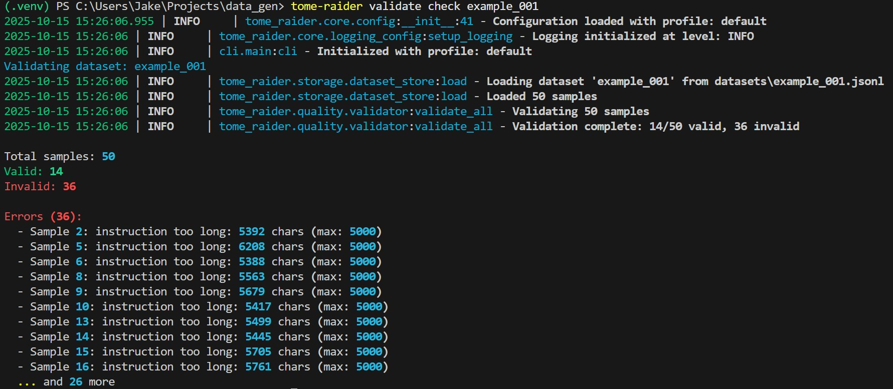
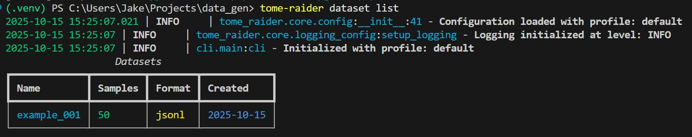

# Tome Raider - GRPO Dataset Builder

An LLM powered dataset builder for creating high-quality training datasets for GRPO LoRA fine-tuning. Build professional-grade datasets with data collection, generation, quality control, and transformation capabilities.

## Features

- **Multiple Data Sources**: Load from files (JSON, JSONL, CSV, Parquet, TXT, PDF), HuggingFace datasets, or web scraping (Stack Overflow, GitHub)
- **6 Generation Strategies**: Self-Instruct, Evol-Instruct, Distillation, Response Generation, Instruction Generation, Chain-of-Thought
- **Quality Control**: Strict validation, multi-metric quality scoring, exact and fuzzy deduplication
- **Flexible Storage**: File-based storage with fast indexing and filtering
- **Config-Driven Pipelines**: YAML-based pipeline configuration for reproducible workflows
- **Comprehensive Metadata**: Track source, quality scores, tags, and review status
- **CLI Interface**: Rich terminal interface for all operations
- **Extensible**: Modular architecture for easy extension

## Installation

```bash
# Clone the repository
git clone https://github.com/jwest33/tome_raider
cd data_gen

# Install dependencies
pip install -r requirements.txt

# Install as package
pip install -e .
```

## Quick Start

### 1. Generate Data from Scratch

```bash
# Generate 100 samples using self-instruct
tome-raider generate self-instruct --model c:\models\Qwen3-4B-Instruct-2507\Qwen3-4B-Instruct-2507-Q8_0.gguf --count 100 --output test_001
```


### 2. Run a Pipeline

```bash
# Execute a complete pipeline from config
tome-raider run examples/math_dataset_pipeline.yaml
```

### 3. Validate and Repair Datasets

```bash
# Validate dataset
tome-raider validate check my_dataset --strict

# Repair datasets with validation errors
tome-raider validate repair my_dataset

# Preview repairs without saving
tome-raider validate repair my_dataset --dry-run

# Score quality
tome-raider quality score my_dataset --save
```



### 4. Interactive Dataset Review

```bash
# Launch interactive review interface
tome-raider review my_dataset

# Open in read-only mode
tome-raider review my_dataset --readonly

# Review with auto-validation
tome-raider review my_dataset --validate
```

### 5. Manage Datasets

```bash
# List all datasets
tome-raider dataset list

# Show dataset info
tome-raider dataset info my_dataset

# Delete dataset
tome-raider dataset delete my_dataset
```



## Usage Guide

### Data Sources

#### Load from Files

```python
from tome_raider.sources.file_loader import FileLoader

# Load from JSON/JSONL/CSV/Parquet
loader = FileLoader({"path": "data/*.jsonl"})
samples = list(loader.load())
```

#### Load from HuggingFace

```python
from tome_raider.sources.dataset_loader import DatasetLoader

# Load HuggingFace dataset
loader = DatasetLoader({
    "dataset": "openai/gsm8k",
    "split": "train"
})
samples = list(loader.load())
```

#### Web Scraping

```python
from tome_raider.sources.scrapers.stackoverflow import StackOverflowScraper

# Scrape Stack Overflow
scraper = StackOverflowScraper({
    "tags": ["python", "machine-learning"],
    "max_samples": 100
})
samples = list(scraper.load())
```

### Data Generation

#### Self-Instruct

```python
from tome_raider.generation.generator import DataGenerator

generator = DataGenerator({})
samples = generator.generate(
    strategy="self_instruct",
    model="models/mistral-7b-instruct.gguf",
    target_count=100
)
```

#### Evol-Instruct

```python
samples = generator.generate(
    strategy="evol_instruct",
    model="models/mistral-7b-instruct.gguf",
    base_instructions="instructions.jsonl",
    evolution_rounds=3
)
```

#### Chain-of-Thought

```python
samples = generator.generate(
    strategy="chain_of_thought",
    model="models/deepseek-coder-33b.gguf",
    problems="problems.jsonl"
)
```

### Quality Control

#### Validation

```python
from tome_raider.quality.validator import DatasetValidator

validator = DatasetValidator({"strict_mode": True})
result = validator.validate_all(samples)

print(f"Valid: {result['valid']}/{result['total']}")
```

#### Repair

```python
from tome_raider.quality.repairer import DatasetRepairer
from tome_raider.quality.validator import DatasetValidator

# Option 1: Fast truncation (default)
validator = DatasetValidator()
repairer = DatasetRepairer(validator=validator, strategy="truncate")

# Repair dataset
result = repairer.repair_and_validate(samples)
repaired_samples = result["dataset"]

print(f"Fixed: {result['improvement']['invalid_count']} samples")
print(f"Valid after repair: {result['after_validation']['valid']}")

# Option 2: LLM-powered summarization (preserves semantic meaning)
config = {
    "repair": {
        "model_path": "path/to/model.gguf"
    }
}

repairer = DatasetRepairer(
    validator=validator,
    strategy="summarize",
    config=config
)

result = repairer.repair_and_validate(samples)
repairer.cleanup()  # Unload model
```

#### Quality Scoring

```python
from tome_raider.quality.quality_scorer import QualityScorer

scorer = QualityScorer()

for sample in samples:
    score = scorer.score_sample(sample)
    sample.metadata.quality_score = score.overall
```

#### Deduplication

```python
from tome_raider.quality.deduplicator import Deduplicator

dedup = Deduplicator()

# Remove exact duplicates
unique, removed = dedup.remove_exact_duplicates(samples)

# Remove near-duplicates
unique, removed = dedup.remove_near_duplicates(samples, threshold=0.85)
```

### Storage and Retrieval

```python
from tome_raider.storage.dataset_store import DatasetStore

store = DatasetStore()

# Save dataset
store.save(samples, "my_dataset", format="jsonl")

# Load dataset
loaded_samples = store.load("my_dataset")

# List all datasets
datasets = store.list_datasets()
```

### Config-Driven Pipelines

Create a pipeline configuration file:

```yaml
# my_pipeline.yaml
name: "My Dataset Pipeline"

operations:
  - name: "Load data"
    type: "source"
    config:
      source_type: "file"
      path: "data/*.jsonl"

  - name: "Generate more samples"
    type: "generate"
    config:
      strategy: "self_instruct"
      model: "models/mistral-7b.gguf"
      target_count: 500

  - name: "Validate"
    type: "validate"
    config:
      strict: true
      remove_invalid: true

  - name: "Score quality"
    type: "quality"
    config: {}

  - name: "Deduplicate"
    type: "deduplicate"
    config:
      exact: true
      near: true

  - name: "Filter high quality"
    type: "filter"
    config:
      quality_min: 0.7

  - name: "Save"
    type: "save"
    config:
      name: "final_dataset"
      format: "jsonl"
```

Run the pipeline:

```bash
tome-raider run my_pipeline.yaml
```

## CLI Commands

### Dataset Management
- `dataset list` - List all datasets
- `dataset info <name>` - Show dataset information
- `dataset delete <name>` - Delete a dataset

### Generation
- `generate self-instruct` - Generate using self-instruct
- More strategies available via pipelines

### Validation
- `validate check <dataset>` - Validate dataset
- `validate repair <dataset>` - Repair dataset validation errors
  - `--strategy <truncate|summarize|split>` - Choose repair strategy
  - `--model <path>` - Model path (required for summarize strategy)
  - `--dry-run` - Preview repairs without saving
  - `--output <name>` - Save to new dataset
  - `--no-backup` - Skip automatic backup

### Quality
- `quality score <dataset>` - Score dataset quality

### Review
- `review <dataset>` - Launch interactive review interface
  - `--readonly` - Open in read-only mode
  - `--validate` - Run validation automatically
  - `--filter-status <status>` - Filter by review status

### Pipeline
- `run <config>` - Run pipeline from config file

## Interactive Dataset Review

Tome Raider provides a powerful terminal-based GUI for manually reviewing, editing, and curating datasets.

### Features

- **Interactive Table View**: Browse all samples with sortable columns
- **Detail View Modal**: View and edit full instruction/response text
- **Quick Actions**: Keyboard shortcuts for fast review workflow
- **Real-time Stats**: Live statistics on approval/rejection/quality
- **Inline Editing**: Multi-line text editing with syntax highlighting
- **Bulk Operations**: Select and process multiple samples at once
- **Auto-validation**: Optional validation as you review
- **Auto-save**: Changes saved on Ctrl+S

### Keyboard Shortcuts

| Key | Action |
|-----|--------|
| `Enter` | Open detail view modal (full-screen edit) |
| `p` | Toggle preview panel (quick view below table) |
| `a` | Approve current sample |
| `r` | Reject current sample |
| `d` | Delete current sample |
| `e` | Edit current sample |
| `s` | Set quality score |
| `t` | Add/remove tags |
| `f` | Filter by status/tags |
| `/` | Search samples |
| `v` | Run validation |
| `Ctrl+S` | Save changes |
| `Ctrl+Q` | Quit |
| `↑/↓` | Navigate samples |
| `PageUp/PageDown` | Scroll in detail/preview |
| `Home/End` | Jump to start/end |

### Usage

```bash
# Launch interactive review
tome-raider review example_001

# Read-only mode (browse without editing)
tome-raider review example_001 --readonly

# Auto-validate as you review
tome-raider review example_001 --validate

# Filter by status
tome-raider review example_001 --filter-status pending
```

### UI Overview

```
┌─ Tome Raider - Dataset Review ──────────────────────────────┐
│ Dataset: example_001                                         │
├──────────────────────────────────────────────────────────────┤
│ ID │ Instruction       │ Response   │ Score │ Status  │ Tags│
├────┼───────────────────┼────────────┼───────┼─────────┼─────┤
│ 0  │ Write a Python... │ Here's...  │ 0.85  │ ✓ Appr. │ py  │
│ 1  │ Explain how...    │ The pro... │ 0.72  │ ⏸ Pend. │     │
│ 2  │ Create a func...  │ ```pyth... │ 0.91  │ ✓ Appr. │ py  │
│ 3  │ Debug this...     │ The bug... │ -     │ ✗ Rej.  │     │
│ >  │ (Selected row - press Enter to view details)            │
├──────────────────────────────────────────────────────────────┤
│ Total: 50 | ✓ Approved: 14 | ✗ Rejected: 10 | ⏸ Pending: 26│
│ Avg Quality: 0.82 | Valid: 48/50                             │
└──────────────────────────────────────────────────────────────┘
```

### Two Ways to View Full Text

**1. Preview Panel (Quick View)**
- Press `p` to toggle a preview panel below the table
- Shows full instruction and response text for selected row
- Navigate with arrow keys - preview updates automatically
- Perfect for quick browsing without opening modals
- Includes word count, line count, and character count
- Scrollable with PageUp/PageDown

**2. Detail View Modal (Full-Screen Edit)**
- Press `Enter` to open a full-screen modal
- Multi-line text editing with syntax highlighting
- Word wrapping for long lines
- Line numbers shown
- Scroll with arrow keys, PageUp/PageDown, Home/End
- Quick approve/reject buttons
- Real-time character/word/line counts

### Review Workflow

1. **Browse**: Navigate table with arrow keys
2. **Quick Preview**: Press `p` to see full text in preview panel below table
3. **Quick Actions**: Use `a` to approve, `r` to reject without opening detail view
4. **Detailed Review**: Press `Enter` for samples needing closer inspection or editing
5. **Edit**: Modify instruction/response text in detail view modal
6. **Save**: Press `Ctrl+S` to save all changes
7. **Filter**: Use `f` to focus on pending items only

### Text Display Features

- **Word Wrapping**: Long lines wrap automatically for readability
- **Line Numbers**: See line numbers in detail view
- **Statistics**: Character count, word count, and line count displayed
- **Scrolling**: Full keyboard navigation support
  - `↑/↓` or `j/k`: Move line by line
  - `PageUp/PageDown`: Jump by page
  - `Home/End`: Jump to start/end
  - Mouse wheel scrolling supported

## Dataset Repair

Tome Raider can automatically repair datasets with validation errors using intelligent strategies:

### Repair Strategies

1. **Truncate** (default): Smart truncation at sentence boundaries
   - Preserves sentence completeness
   - Maintains context and readability
   - Falls back to paragraph/word boundaries if needed
   - Fast, no model required
   - **Limitation**: Semantically arbitrary - may cut important context

2. **Summarize**: LLM-powered intelligent condensing
   - Uses an LLM to preserve semantic meaning while shortening
   - Maintains all key requirements, constraints, and intent
   - Preserves instruction-response validity
   - Requires model file (GGUF format)
   - Slower but semantically accurate
   - Falls back to truncation if LLM fails

3. **Split**: Divide long samples into multiple shorter samples
   - Preserves all content
   - Creates multiple valid samples

### Usage Examples

```bash
# Quick repair with truncation (default)
tome-raider validate repair example_001

# Preview repairs without making changes
tome-raider validate repair example_001 --dry-run

# Use LLM-powered summarization (preserves semantic meaning)
tome-raider validate repair example_001 --strategy summarize --model path/to/model.gguf

# With specific model
tome-raider validate repair example_001 --strategy summarize \
  --model "C:\models\Qwen3-4B-Instruct-Q8_0.gguf"

# Repair and save to new dataset (keeps original)
tome-raider validate repair example_001 --output example_001_fixed

# Repair without backup
tome-raider validate repair example_001 --no-backup

# Use split strategy
tome-raider validate repair example_001 --strategy split
```

### What Gets Fixed

The repair system automatically fixes:
- **Instructions too long**: Condensed to max length (5000 chars by default)
- **Responses too long**: Condensed to max length (10000 chars by default)

**Repair Methods:**
- **Truncate**: Smart multi-tier approach (sentence → paragraph → word boundaries)
- **Summarize**: LLM intelligently condenses while preserving all key requirements
- **Split**: Divides into multiple valid samples

### Repair Output

The repair command shows:
- Before/after validation statistics
- Number of samples fixed
- Sample-by-sample changes
- Remaining errors (if any)

Example output:
```
Before Repair:
  Valid: 14/50
  Invalid: 36/50

After Repair:
  Valid: 50/50
  Invalid: 0/50

Improvement:
  Fixed: 36 samples
  Already valid: 14
  Repaired: 36
  Failed to repair: 0
```

## Generation Strategies

1. **Self-Instruct**: Generate new instructions from seed tasks
2. **Evol-Instruct**: Evolve instructions through multiple rounds
3. **Distillation**: Use teacher model to generate training data
4. **Response Generation**: Generate responses for existing instructions
5. **Instruction Generation**: Extract instructions from documents
6. **Chain-of-Thought**: Generate step-by-step reasoning

## Configuration

### Profiles

- `default` - Balanced settings
- `dev` - Development mode (verbose logging, lenient validation)
- `prod` - Production mode (strict validation, larger batches)

Use profiles:

```bash
tome-raider --profile dev generate ...
```

### Environment Variables

Override config with environment variables:

```bash
export DB_STORAGE_BASE_PATH="./my_datasets"
export DB_LOGGING_LEVEL="DEBUG"
```

## Quality Metrics

The quality scorer evaluates samples across multiple dimensions:

- **Instruction Clarity**: Grammar, readability, specificity
- **Instruction Complexity**: Vocabulary richness, concept depth
- **Response Completeness**: Addresses all aspects
- **Response Coherence**: Logical flow and structure
- **Alignment**: Response matches instruction intent
- **Diversity**: Vocabulary variety

## Contributing

Contributions are welcome! The codebase is designed to be extensible:

- Add new data sources by extending `DataSource`
- Add new generation strategies by extending `GenerationStrategy`
- Add new validators by extending the validation system
- Add new transformations by creating transformation modules

## Example Workflows

### Build a Math Dataset

```bash
# 1. Load seed data
# 2. Evolve instructions
# 3. Validate and deduplicate
# 4. Score quality
# 5. Filter and save

tome-raider run examples/math_dataset_pipeline.yaml
```

### Scrape and Clean Web Data

```python
from tome_raider.sources.scrapers.stackoverflow import StackOverflowScraper
from tome_raider.quality.deduplicator import Deduplicator
from tome_raider.storage.dataset_store import DatasetStore

# Scrape
scraper = StackOverflowScraper({"tags": ["python"], "max_samples": 1000})
samples = list(scraper.load())

# Deduplicate
dedup = Deduplicator()
samples, _ = dedup.remove_exact_duplicates(samples)

# Save
store = DatasetStore()
store.save(samples, "stackoverflow_python")
```

### Generate with Distillation

```python
from tome_raider.generation.generator import DataGenerator

generator = DataGenerator({})

# Use large teacher model
samples = generator.generate(
    strategy="distillation",
    model="models/mixtral-8x7b.gguf",
    prompts="prompts.jsonl",
    batch_size=8
)
```

## Documentation

- `DESIGN.md` - Comprehensive design document
- `IMPLEMENTATION_STATUS.md` - Implementation progress and roadmap
- `examples/` - Example configurations and workflows

## Troubleshooting

### llama-server not found

Ensure llama-server is installed and in PATH:

```bash
which llama-server
```

### Module import errors

Install in development mode:

```bash
pip install -e .
```

### Permission errors

Check directory permissions for `datasets/`, `logs/`, `.cache/`

## Examples

- [Examples](examples/) - Sample configurations

## License

Created and maintained by **jwest33** ([loracraft.org](https://loracraft.org))  
Licensed under the [MIT License](./LICENSE).  

## Acknowledgments

Built with:
- Click for CLI
- Rich for terminal UI
- Loguru for logging
- llama.cpp for local LLM inference
- HuggingFace datasets for data loading

---

**GRPO Dataset Builder** - Build professional-grade training datasets with ease.
